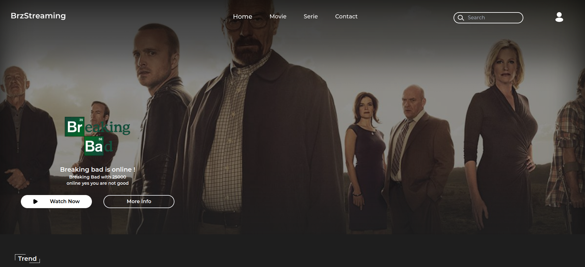

# BrzStreaming

BrzStreaming is a open source project for movie streaming. Its not finished, so there are still bugs. When i finished school i continue at the night to contribute this project.

## Badges

[](https://choosealicense.com/licenses/gpl-3.0/)

# Table of contents

1. [Preview](#preview)
2. [Requirement](#equirement)
3. [Run Locally](#run-locally)
4. [Feedback](#feedback)
5. [License](#License)

## Preview



## Requirement

- **Node.js**: Make sur to have Node.js installed in your pc.
- **Yarn**: Its facultative, but thoughtful.

## Run Locally

Clone the project

```bash
  git clone https://github.com/VeroniDeev/brzstreaming.git
```

Go to the project directory

```bash
  cd brzstreaming
```

Install dependencies

```bash
yarn install
```

or

```bash
npm install
```

Start the server

```bash
yarn run dev
```

## Feedback

If you have any feedback, please feel free to contact us at zoubheir@gmail.com.

## License

[GPLv3](https://choosealicense.com/licenses/gpl-3.0/)
